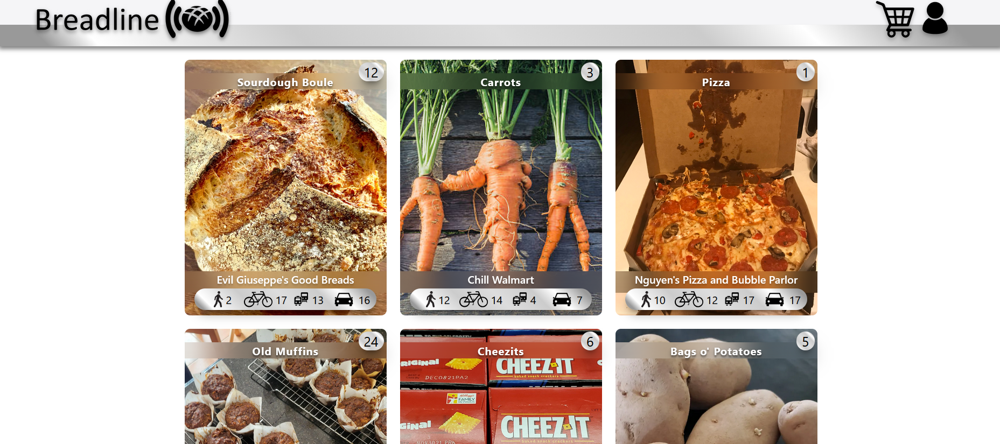
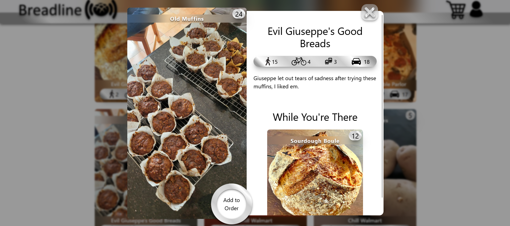
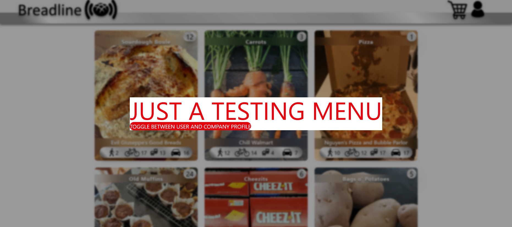
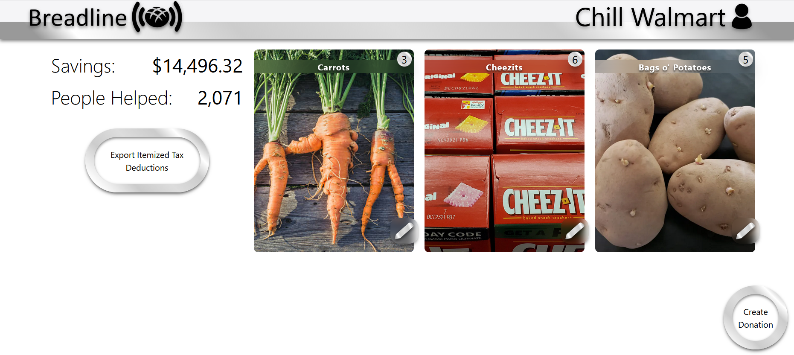

# Breadline

This is a free food waste sharing app.
This app allows people to get free food that would never make it to a food bank.
The idea is users order and pickup food waste which turns into tax deductions for the company that shared it.
The app also acts as a middle man to protect companies from any legal battles.

## User Page

The user gets to see each individual food item near them and the time it would take for them to get to it.
Food is listed not restaurants, the reason for this is that it's more important what food is actually being offered not where it's from.
Each food item expands on hover to signify that it is clickable.

## Order Pop Up

After a user clicks on a food item the order pop up will appear which includes the description of the item.
On this page a user can order the item and see other items offered by the same company.

## Testing Menu

To switch to company profile, click on the profile icon in the top right of the user page.
This opens the testing menu and clicking on the button switches to a company profile.

## Company Profile

The company page allows a company to add and edit their listings.
They can see their savings and export their tax deductions on the left.
